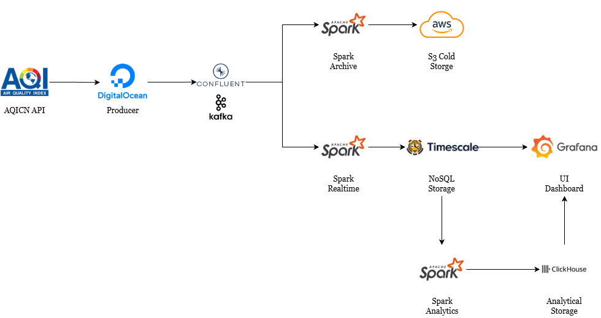

# 🌬️ Vietnam Air Quality Monitoring System

A real-time big data pipeline for monitoring and analyzing air quality across major Vietnamese cities (Hanoi, Da Nang, Can Tho).


## 📋 Table of Contents

- [Overview](#overview)
- [Architecture](#architecture)
- [Technologies](#technologies)
- [Project Structure](#project-structure)
- [Getting Started](#getting-started)
- [Configuration](#configuration)
- [Usage](#usage)
- [Kubernetes Deployment](#kubernetes-deployment)
- [Contributing](#contributing)
- [License](#license)

## 🔍 Overview

This project implements a complete big data pipeline for collecting, processing, and analyzing air quality data from Vietnamese cities. The system fetches real-time data from the [AQICN API](https://aqicn.org/api/), processes it through Apache Kafka and Spark Streaming, stores it in TimescaleDB and ClickHouse, and archives historical data to AWS S3.

### Key Features

- **Real-time Data Ingestion**: Continuous collection of air quality metrics (AQI, PM2.5, PM10, temperature, humidity)
- **Stream Processing**: Apache Spark Structured Streaming for real-time data processing
- **Multi-Database Architecture**: TimescaleDB for time-series data, ClickHouse for analytics
- **Cold Storage Archive**: AWS S3 for long-term data retention
- **Hourly & Daily Analytics**: Automated aggregation jobs for insights
- **Visualization**: Grafana dashboards for monitoring
- **Cloud-Native**: Kubernetes-ready with Helm charts and CronJobs


## 🏗️ Architecture


## 🛠️ Technologies

| Component | Technology | Purpose |
|-----------|------------|---------|
| **Data Source** | AQICN API | Real-time air quality data |
| **Message Broker** | Apache Kafka | Event streaming |
| **Stream Processing** | Apache Spark 3.5.0 | Real-time & batch processing |
| **Time-Series DB** | TimescaleDB (PostgreSQL 15) | Real-time data storage |
| **Analytics DB** | ClickHouse | OLAP queries & aggregations |
| **Object Storage** | MinIO / AWS S3 | Cold data archive |
| **Visualization** | Grafana | Monitoring dashboards |
| **Container Runtime** | Docker | Containerization |
| **Orchestration** | Kubernetes | Production deployment |

## 📁 Project Structure

```
├── data/
│   └── city_metadata.json       # City configuration and thresholds
├── docker-compose.yaml          # Local development environment
├── Dockerfile                   # Application container image
├── k8s/                         # Kubernetes manifests
│   ├── namespace.yaml
│   ├── deployment-realtime-*.yaml
│   ├── deployment-archive-*.yaml
│   ├── cronjob-analytics-*.yaml
│   └── deploy-to-eks.sh
├── scripts/                     # Entry point scripts
│   ├── produce_*.py             # Kafka producers per city
│   ├── run_realtime_*.py        # Real-time consumers
│   ├── run_archive_*.py         # S3 archiver jobs
│   └── run_analytics_*.py       # Analytics jobs
├── src/
│   ├── common/
│   │   └── config.py            # Configuration management
│   ├── ingestion/
│   │   ├── api_client.py        # AQICN API client
│   │   ├── producer.py          # Kafka producer
│   │   └── produce_city.py      # City data fetcher
│   └── processing/
│       ├── analytics_daily.py   # Daily aggregation
│       ├── analytics_hourly.py  # Hourly aggregation
│       └── archive.py           # S3 cold storage
└── requirements.txt             # Python dependencies
```

## 🚀 Getting Started

### Prerequisites

- Python 3.11+
- Docker & Docker Compose
- Apache Kafka cluster (or use Confluent Cloud)
- AQICN API token ([Get one here](https://aqicn.org/data-platform/token/))

### Installation

1. **Clone the repository**
   ```bash
   git clone https://github.com/hunganh1310/20251-IT4931-HUST.git
   cd 20251-IT4931-HUST
   ```

2. **Create virtual environment**
   ```bash
   python -m venv venv
   source venv/bin/activate  # Linux/Mac
   # or
   venv\Scripts\activate     # Windows
   ```

3. **Install dependencies**
   ```bash
   pip install -r requirements.txt
   ```

4. **Start infrastructure services**
   ```bash
   docker-compose up -d
   ```

## ⚙️ Configuration

Create a `.env` file in the project root:

```env
# AQICN API
AQICN_TOKEN=your_aqicn_token_here

# Kafka Configuration
KAFKA_BOOTSTRAP_SERVERS=localhost:29092
KAFKA_SECURITY_PROTOCOL=PLAINTEXT
KAFKA_SASL_MECHANISM=PLAIN
KAFKA_SASL_USERNAME=
KAFKA_SASL_PASSWORD=
AQICN_TOPIC=raw.airquality

# TimescaleDB Configuration
DB_HOST=localhost
DB_PORT=5432
DB_NAME=airquality
DB_USER=airquality
DB_PASSWORD=airquality123

# ClickHouse Configuration
CLICKHOUSE_HOST=localhost
CLICKHOUSE_PORT=8123
CLICKHOUSE_DB=airquality
CLICKHOUSE_USER=airquality
CLICKHOUSE_PASSWORD=airquality123

# AWS S3 / MinIO Configuration
AWS_ACCESS_KEY_ID=minioadmin
AWS_SECRET_ACCESS_KEY=minioadmin
AWS_S3_BUCKET=airquality-archive
AWS_REGION=us-east-1

# Spark Configuration
SPARK_CHECKPOINT_LOCATION=/tmp/spark_checkpoints
```

## 📖 Usage

### 1. Produce Data to Kafka

Fetch air quality data from AQICN API and send to Kafka:

```bash
# Produce data for specific cities
python scripts/produce_hanoi.py
python scripts/produce_danang.py
python scripts/produce_cantho.py
```

### 2. Run Real-time Processing

Stream data from Kafka to TimescaleDB:

```bash
python scripts/run_realtime_hanoi.py
python scripts/run_realtime_danang.py
python scripts/run_realtime_cantho.py
```

### 3. Run Archive Jobs

Archive data from Kafka to S3:

```bash
python scripts/run_archive_hanoi.py
python scripts/run_archive_danang.py
python scripts/run_archive_cantho.py
```

### 4. Run Analytics

Execute hourly and daily analytics:

```bash
# Hourly analytics per city
python scripts/run_analytics_hourly_hanoi.py
python scripts/run_analytics_hourly_danang.py
python scripts/run_analytics_hourly_cantho.py

# Daily analytics (all cities)
python scripts/run_analytics_daily.py
```

### 5. Access Services

| Service | URL | Credentials |
|---------|-----|-------------|
| Grafana | http://localhost:3000 | admin / admin |
| MinIO Console | http://localhost:9001 | minioadmin / minioadmin |
| ClickHouse HTTP | http://localhost:8123 | airquality / airquality123 |
| TimescaleDB | localhost:5432 | airquality / airquality123 |

## ☸️ Kubernetes Deployment

### Deploy to Kubernetes

1. **Create namespace and secrets**
   ```bash
   kubectl apply -f k8s/namespace.yaml
   kubectl create secret generic airquality-secrets \
     --from-env-file=.env \
     -n airquality
   ```

2. **Deploy real-time processors**
   ```bash
   kubectl apply -f k8s/deployment-realtime-hanoi.yaml
   kubectl apply -f k8s/deployment-realtime-danang.yaml
   kubectl apply -f k8s/deployment-realtime-cantho.yaml
   ```

3. **Deploy archive jobs**
   ```bash
   kubectl apply -f k8s/deployment-archive-hanoi.yaml
   kubectl apply -f k8s/deployment-archive-danang.yaml
   kubectl apply -f k8s/deployment-archive-cantho.yaml
   ```

4. **Deploy analytics CronJobs**
   ```bash
   kubectl apply -f k8s/cronjob-analytics-hourly-hanoi.yaml
   kubectl apply -f k8s/cronjob-analytics-hourly-danang.yaml
   kubectl apply -f k8s/cronjob-analytics-hourly-cantho.yaml
   kubectl apply -f k8s/cronjob-analytics-daily.yaml
   ```

### Docker Build

```bash
docker build -t airquality:latest .
docker tag airquality:latest your-registry/airquality:latest
docker push your-registry/airquality:latest
```

## 🤝 Contributing

1. Fork the repository
2. Create a feature branch (`git checkout -b feature/amazing-feature`)
3. Commit your changes (`git commit -m 'Add amazing feature'`)
4. Push to the branch (`git push origin feature/amazing-feature`)
5. Open a Pull Request

## 📄 License

This project is licensed under the MIT License - see the [LICENSE](LICENSE) file for details.


## 🙏 Acknowledgments

- [AQICN](https://aqicn.org/) for providing the Air Quality API
- Apache Spark, Kafka, and the open-source community
