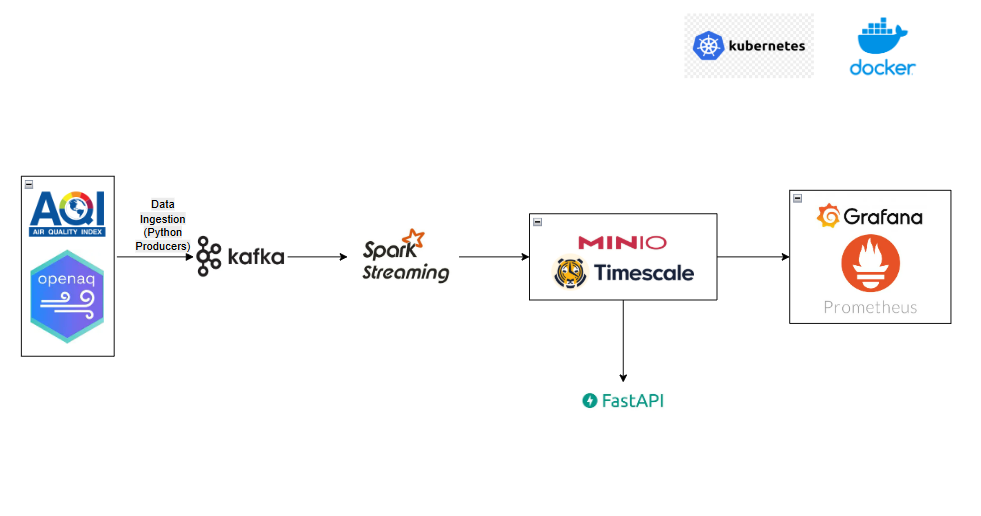

# Air Quality Monitoring & Forecasting System
## Vietnam / Hanoi - Big Data Project

---

### HUST_IT4931
**Đại học Bách Khoa Hà Nội**  
**Môn học:** Lưu trữ và xử lý dữ liệu lớn  
**Nhóm:** 

---

## Tổng Quan Dự Án

Hệ thống giám sát và dự báo chất lượng không khí thời gian thực cho **Hà Nội** sử dụng **Kappa Architecture** và công nghệ Big Data.

### Mục Tiêu
- Thu thập dữ liệu chất lượng không khí tại Việt Nam (Hà Nội)
- Xử lý và phân tích dữ liệu streaming real-time
- Dự báo PM2.5 ngắn hạn (1-3 giờ) sử dụng Machine Learning
- Phát hiện bất thường cảm biến và cảnh báo sớm
- Hiển thị dashboard trực quan với EPA color standards

### Pipeline Tổng Quan
```
AQICN API → Kafka → Spark Streaming → TimescaleDB/MinIO → FastAPI → Grafana
OpenAQ API  → Kafka →     ↑ Joint Processing
```

---

## Nguồn Dữ Liệu

- **AQICN API** (chính): 67+ trạm VN, cập nhật mỗi giờ, dữ liệu thời gian thực với AQI và các chất ô nhiễm
- **OpenAQ**: Cross-validation và metadata bổ sung cho các trạm monitoring
- **Open-Meteo**: Weather & forecast data (dự kiến triển khai) 

---

## Kiến Trúc Hệ Thống


### Kappa Architecture

**Tại sao chọn Kappa?**
- Đơn giản hơn Lambda (1 pipeline thay vì 2)
- Dễ bảo trì (1 codebase)
- Nhất quán dữ liệu
- Phù hợp với streaming data

### Luồng Xử Lý

```
┌─────────────────────┐
│   Data Sources      │  AQICN API (real-time) + OpenAQ API (metadata)
└──────────┬──────────┘
           ↓
┌─────────────────────┐
│  Python Producers   │  produce_aqicn.py + produce_openaq.py
└──────────┬──────────┘
           ↓
┌─────────────────────┐
│   Kafka Topics      │  raw.airquality + raw.openaq
└──────────┬──────────┘
           ↓
┌─────────────────────┐
│  Spark Streaming    │  • Individual: spark_stream_aqicn.py, spark_stream_openaq.py
│                     │  • Joint: spark_stream_joint.py (spatial join + enrichment)
└──────────┬──────────┘
           ↓
┌─────────────────────┐
│  Storage Layer      │  • aqicn_measurements (individual)
│                     │  • air_quality_enriched (joint/enriched)
│                     │  • MinIO (cold storage)
└──────────┬──────────┘
           ↓
┌─────────────────────┐
│  FastAPI + Grafana  │  Dashboard & API (dự kiến)
└─────────────────────┘
```

---

## Tech Stack

| Component | Technology | Lý Do |
|-----------|-----------|-------|
| **Message Queue** | Kafka | Chuẩn công nghiệp |
| **Stream Processing** | Spark Structured Streaming | Yêu cầu môn học |
| **Time-Series DB** | TimescaleDB | SQL, tối ưu time-series |
| **Object Storage** | MinIO | S3-compatible, K8s-friendly |
| **API** | FastAPI | Python async, WebSocket |
| **Dashboard** | Grafana | Time-series visualization |
| **Orchestration** | Kubernetes | Production-ready |

---

## Data Processing Features

### Streaming Architecture
- **Individual Streams**: Xử lý riêng biệt cho từng nguồn dữ liệu (AQICN, OpenAQ)
- **Joint Stream Processing**: Kết hợp dữ liệu từ nhiều nguồn với spatial join và temporal correlation
- **Geo-spatial Bucketing**: Nhóm trạm theo vị trí địa lý với độ chính xác ~1km
- **Real-time AQI Calculation**: Tính toán AQI theo chuẩn US EPA cho PM2.5 và PM10

### Data Enrichment
- **Spatial Join**: Kết hợp dữ liệu từ các trạm gần nhau (cùng lat/lon bucket)
- **Temporal Correlation**: Join dữ liệu trong cửa sổ thời gian 5 phút
- **Missing Data Handling**: Fallback giữa các nguồn dữ liệu
- **Standardized Schema**: Chuẩn hóa schema chung cho tất cả nguồn dữ liệu

### Machine Learning (Dự kiến)
- **Model:** XGBoost (R² = 0.94-0.97)
- **Features:** Lag values, rolling stats, time patterns, weather data
- **Anomaly Detection:** Isolation Forest (real-time), LSTM Autoencoder (accuracy cao)
- **Output:** Dự báo PM2.5 1-3 giờ tới

---

## Dashboard & Monitoring

### Dashboard Components
1. AQI Gauge (EPA color-coded)
2. Geographic map (color-coded stations)
3. Time-series charts (PM₂.₅, PM₁₀, AQI)
4. Forecast panel (1-3h predictions)
5. Alert table & sensor health

### Alerts
- **HighPM25**: PM2.5 > 150 µg/m³
- **HazardousAQI**: AQI > 300
- **SensorOffline**: No data trong 10 phút

---

## Implementation Status

### ✅ Đã Hoàn Thành
| Component | Status | Description |
|-----------|--------|-------------|
| **Data Ingestion** | ✅ | AQICN & OpenAQ producers với Kafka |
| **Individual Streaming** | ✅ | Spark streams cho từng nguồn dữ liệu |
| **Joint Processing** | ✅ | Spatial & temporal join với data enrichment |
| **Database Schema** | ✅ | TimescaleDB với hypertables |
| **Infrastructure** | ✅ | Docker Compose setup |

### 🚧 Đang Phát Triển
| Component | Priority | Timeline |
|-----------|----------|----------|
| **Cold Storage** | High | Week 7-8 |
| **ML Pipeline** | Medium | Week 8-9 |
| **Dashboard & API** | High | Week 9-10 |
| **Monitoring & Alerting** | Medium | Week 10-11 |

### 📋 Implementation Timeline
| Phase | Duration | Deliverables |
|-------|----------|--------------|
| **1. Foundation** | ✅ Week 1-2 | Kafka + data ingestion |
| **2. Processing** | ✅ Week 3-4 | Individual + joint streaming |
| **3. Storage** | 🚧 Week 5-6 | Cold storage + optimization |
| **4. ML & Analytics** | 🔄 Week 7-8 | Forecast models + anomaly detection |
| **5. Visualization** | 📋 Week 9-10 | Dashboard + API |
| **6. Production** | 📋 Week 11-12 | Deployment + monitoring |

---

## Resources

- **Development:** Minikube (local, free)
- **Production:** GKE/EKS/AKS với student credits
- **Requirements:** ~40 cores, ~80GB RAM, ~1TB storage

---

## File Structure & Components

```
├── src/
│   ├── common/
│   │   ├── config.py              # Configuration management & logging
│   │   └── __init__.py
│   ├── ingestion/
│   │   ├── api_client.py          # Generic API client wrapper
│   │   ├── producer.py            # Kafka producer wrapper
│   │   └── __init__.py
│   └── processing/
│       ├── spark_stream_aqicn.py  # Individual AQICN stream processing
│       ├── spark_stream_openaq.py # Individual OpenAQ stream processing
│       ├── spark_stream_joint.py  # 🆕 Joint processing với spatial join
│       ├── cold_storage_aqicn.py  # Batch processing for AQICN
│       ├── cold_storage_openaq.py # Batch processing for OpenAQ
│       └── __init__.py
├── scripts/
│   ├── produce_aqicn.py           # AQICN data producer
│   ├── produce_openaq.py          # OpenAQ data producer
│   ├── run_spark_aqicn.py         # Execute individual AQICN streaming
│   ├── run_spark_openaq.py        # Execute individual OpenAQ streaming
│   ├── run_spark_streaming.py     # Execute joint streaming (main)
│   ├── run_cold_storage_aqicn.py  # Execute AQICN batch processing
│   └── run_cold_storage_openaq.py # Execute OpenAQ batch processing
├── docker-compose.yaml            # Infrastructure setup
├── requirements.txt               # Python dependencies
└── README.md                      # Project documentation
```

### Key Features của Joint Processing
- **Spatial Bucketing**: Nhóm trạm theo lat/lon với precision 2 decimal (~1km)
- **Temporal Window**: Join dữ liệu trong cửa sổ 5 phút
- **Unified Schema**: Chuẩn hóa output từ nhiều nguồn khác nhau
- **AQI Auto-calculation**: Tự động tính AQI theo EPA standard nếu source không có
- **Fallback Logic**: Ưu tiên dữ liệu AQICN, fallback sang OpenAQ khi cần

---

**Status:** Core streaming architecture hoàn thành, đang phát triển ML và dashboard